# 🌫️ AQI Predictor & Dashboard


**AQI Predictor** is a 100% serverless, end-to-end machine learning data pipeline and microservice architecture designed to ingest, engineer, and store Air Quality Index (AQI) data to predict air quality up to 72 hours ahead.

---

## ✨ Key Features
- **Serverless Data Pipelines**: Fully automated via GitHub Actions to fetch daily weather/AQI data and push features to Hopsworks.
- **Automated Model Retraining**: GitHub Actions automatically pull fresh data, retrain the model, and register the new version.
- **FastAPI Backend**: A high-performance microservice serving model forecasts and SHAP feature explanations.
- **Streamlit Dashboard**: A beautiful, interactive frontend providing real-time UI, historical trends, and feature importance.
- **Explainable AI (XAI)**: Integrated SHAP values to explain *why* the model makes specific AQI predictions.

---

## 🏗️ Architecture

```mermaid
graph LR
    A[APIs: AQICN / OpenWeather] -->|Fetch Data| B(GitHub Actions: Feature Pipeline)
    B -->|Push Features| C[(Hopsworks Feature Store)]
    C -->|Pull Data| D(GitHub Actions: Training Pipeline)
    D -->|Register Model| E[(Hopsworks Model Registry)]
    
    C -->|Pull Recent Features| F[FastAPI Backend]
    E -->|Pull Latest Model| F
    
    F -->|Serve Forecasts & SHAP| G[Streamlit Dashboard]
    
    style B fill:#f9f,stroke:#333,stroke-width:2px
    style D fill:#f9f,stroke:#333,stroke-width:2px
    style F fill:#bbf,stroke:#333,stroke-width:2px
    style G fill:#bfb,stroke:#333,stroke-width:2px
```



---

## 📁 Project Structure

```text
aqi-predictor/
├── .github/workflows/       # Serverless automation pipelines
├── app/                     # Microservices
│   ├── api.py               # FastAPI Backend
│   ├── predict.py           # Inference & SHAP logic
│   └── streamlit_app.py     # Streamlit Frontend Dashboard
├── src/                     # Data & ML Pipelines
│   ├── data_fetch.py
│   ├── feature_engineering.py
│   ├── feature_store.py
│   └── run_pipeline.py
├── tests/                   # Unit test suite
├── .env.example
├── requirements.txt
└── README.md
```

---

## ⚙️ Environment Setup

### 1. Clone & Navigate to Project Directory
```bash
git clone <repository-url>
cd aqi-predictor
```

### 2. Create and Activate Virtual Environment
```bash
python -m venv .venv

# On Windows (PowerShell):
.venv\Scripts\Activate.ps1

# On macOS/Linux:
source .venv/bin/activate
```

### 3. Install Dependencies
```bash
pip install -r requirements.txt
```

### 4. Configure Environment Variables (`.env`)
Copy the template file `.env.example` to `.env`:
```bash
cp .env.example .env
```

Open `.env` and fill in your configuration values:
```env
# API Credentials
AQICN_API_TOKEN=your_aqicn_api_token_here
OPENWEATHER_API_KEY=your_openweather_api_key_here
HOPSWORKS_API_KEY=your_hopsworks_api_key_here

# Hopsworks Configuration
HOPSWORKS_PROJECT_NAME=your_hopsworks_project_name_here

# Location Settings
CITY_NAME=Lahore
CITY_LAT=31.558
CITY_LON=74.3507
```

---

## 🚀 Running Locally

### 1. Start the Microservices (Backend + Frontend)
The project is split into a backend API and a frontend UI. You need to run both simultaneously.

**Terminal 1 (Start the FastAPI Backend):**
```bash
uvicorn app.api:app --reload --port 8000
```
*You can access the interactive API documentation at [http://localhost:8000/docs](http://localhost:8000/docs).*

**Terminal 2 (Start the Streamlit Frontend):**
```bash
streamlit run app/streamlit_app.py --server.port 8501
```

### 2. Execute Data Pipeline Manually (Optional)
To test the data ingestion pipeline locally without writing to Hopsworks Feature Store, use the `--dry-run` flag:
```bash
python -m src.run_pipeline --dry-run
```

---

## ☁️ Serverless Automation & Deployment

### 1. GitHub Actions (Pipelines)
The project utilizes GitHub Actions to operate without a dedicated server:
- `.github/workflows/feature_pipeline.yml`: Runs daily to fetch fresh data and update the Feature Store.
- `.github/workflows/training_pipeline.yml`: Runs periodically to retrain the model on recent data and update the Model Registry.

### 2. Frontend Deployment (Streamlit Community Cloud)
This repository is configured to be deployed automatically on [Streamlit Community Cloud](https://streamlit.io/cloud).

**Steps to deploy:**
1. Connect your GitHub repository to Streamlit Community Cloud.
2. Set the **Main file path** to `app/streamlit_app.py`.
3. In the Streamlit app dashboard, go to **Settings > Secrets**.
4. Paste the required API keys using TOML format. It should exactly match this snippet:

```toml
# Streamlit Cloud Secrets (.streamlit/secrets.toml format)
AQICN_API_TOKEN = "your-aqicn-token"
OPENWEATHER_API_KEY = "your-openweather-key"
HOPSWORKS_API_KEY = "your-hopsworks-key"
HOPSWORKS_PROJECT_NAME = "your-hopsworks-project-name"
CITY_NAME = "Lahore"
CITY_LAT = "31.558"
CITY_LON = "74.3507"
```

### 3. Backend Deployment
To host the prediction API publicly, deploy the FastAPI app (`app/api.py`) to a cloud provider like **Render**, **Railway**, or **Heroku**. Once deployed, update the API URL in `app/streamlit_app.py` to point to your new backend URL instead of `localhost`.

---

## 🧪 Testing

To run the complete unit test suite:
```bash
python -m unittest discover -s tests
```

Or using `pytest`:
```bash
pytest
```
